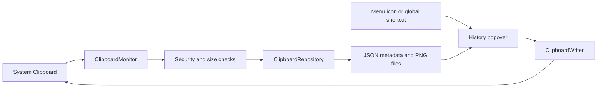

# Maclipp

Maclipp is a lightweight, native clipboard-history app for macOS. It records copied text and images locally, then exposes a searchable history from the menu bar or with a configurable global shortcut.

Maclipp has no server, account, analytics, or network dependency. Clipboard data stays on the Mac.

## Features

- Captures plain text and images, including PNG, JPEG, WebP, TIFF, and image files copied from Finder
- Opens a menu-bar popover with a configurable global shortcut (`Option+Space` by default)
- Searches clip text and source-application names
- Supports arrow-key navigation and Return to select
- Shows `Command+1` through `Command+5` shortcuts for the five newest visible clips
- Displays larger image previews when hovering over thumbnails
- Deduplicates repeated content and moves it to the newest position
- Supports pinning, individual deletion, pausing, and clearing unpinned history
- Skips pasteboards marked concealed, transient, or autogenerated by their source application
- Rejects text over 1 MiB, encoded images over 20 MiB, and images over 50 megapixels
- Restores focus to the previously active application after selecting a clip
- Optionally launches at login
- Handles menu-bar placement across multiple displays

## Requirements

- macOS 13 Ventura or newer
- The build script produces a native binary for the Mac on which it runs
- Swift 5.10 or newer to build from source

## Install And Run

Build the application bundle:

```bash
./scripts/build-app.sh
open dist/Maclipp.app
```

For regular use, move `Maclipp.app` from `dist/` into `/Applications`. Open the menu-bar popover, select the gear icon, and enable **Launch at Login** if desired.

The local build is ad-hoc signed. Distributing Maclipp to other people requires signing with an Apple Developer ID certificate and notarizing the final app.

## Usage

| Action | Shortcut or control |
| --- | --- |
| Open or close history | Configurable; defaults to `Option+Space` |
| Open history from menu bar | Click the Copies icon |
| Search | Start typing in the search field |
| Move selection | Up Arrow / Down Arrow |
| Restore selected clip | Return |
| Restore one of the first five clips | `Command+1` through `Command+5` |
| Close history | Escape |
| Pin or delete a clip | Right-click the row |
| Preview an image | Hover over its thumbnail |
| Pause, clear history, or quit | Gear menu |
| Change the global shortcut | Gear menu → Keyboard Shortcut |

Selecting an item places it back on the system clipboard and returns focus to the previous application. Press `Command+V` to paste it. Maclipp does not simulate paste automatically because that would require Accessibility permission.

### Changing The Global Shortcut

The default shortcut is `Option+Space`. To change it:

1. Open the Maclipp history popover.
2. Select the gear icon.
3. Choose **Keyboard Shortcut**.
4. Click the recorder field and press the new key combination.
5. Select **Save**.

Shortcuts must include at least one modifier: Command, Option, Control, or Shift. Maclipp applies a successful shortcut immediately and stores it in `UserDefaults`, so it remains active after restarting the app or Mac.

If macOS or another application has already reserved the requested shortcut, Maclipp keeps the previously working shortcut and displays an error. Use **Reset to ⌥Space** in the recorder to restore the default.

### Screenshots

The standard `Command+Shift+3` and `Command+Shift+4` shortcuts save screenshots as files and do not put them on the clipboard. Use these variants for Maclipp to capture them:

- `Control+Command+Shift+3`: copy the full screen to the clipboard
- `Control+Command+Shift+4`: copy a selected region to the clipboard

## Storage And Retention

Maclipp persists clipboard history across app restarts, logouts, and device reboots.

```text
~/Library/Application Support/Maclipp/
├── history.json    Text content and item metadata
└── Images/         Image clips stored as PNG files
```

History has no time-based expiration. Maclipp keeps at most **100 total records**:

- The oldest unpinned item is removed first when the limit is exceeded.
- Pinned items are preserved when an unpinned item can be removed.
- If all 100 records are pinned, the oldest pinned item is removed when a new clip arrives.
- Removing an image record also removes its corresponding image file.

Use **Clear Unpinned History** from the gear menu to remove all unpinned entries. Individual entries can be deleted from their context menu.

## Privacy

All processing and storage are local. Maclipp does not send clipboard contents anywhere.

Clipboard managers can capture sensitive information. Pause recording before copying secrets that should not enter history. Sensitive pasteboard markers are detected, but password-manager-specific application exclusions are not implemented yet.

Maclipp does not retain pasteboards carrying the standard concealed, transient, or autogenerated markers used by security-conscious source applications. These markers are advisory, so unmarked secrets can still enter history. Storage directories use owner-only `0700` permissions and history/image files use `0600` permissions.

## Architecture

```text
Sources/Maclipp/
├── App/          Lifecycle, shared state, and service coordination
├── Clipboard/    Pasteboard monitoring, image decoding, and restoration
├── Hotkeys/      Configurable Carbon global-hotkey registration and persistence
├── Storage/      JSON metadata, PNG persistence, deduplication, and retention
└── UI/           Menu-bar popover, search, shortcuts, and previews
```



The main request flow is:

1. [`MaclippApp.swift`](Sources/Maclipp/App/MaclippApp.swift) starts Maclipp as a menu-bar accessory app. [`AppModel.swift`](Sources/Maclipp/App/AppModel.swift) creates and coordinates the repository, clipboard monitor, menu-bar controller, global hotkey, and launch-at-login behavior.
2. [`ClipboardMonitor.swift`](Sources/Maclipp/Clipboard/ClipboardMonitor.swift) polls `NSPasteboard.general.changeCount` every 400 milliseconds because macOS does not provide a general clipboard-change notification. It ignores changes while recording is paused and reads image content before falling back to text.
3. [`ClipboardSecurityPolicy.swift`](Sources/Maclipp/Clipboard/ClipboardSecurityPolicy.swift) rejects concealed, transient, or autogenerated pasteboards and enforces payload limits before data is retained. Images are decoded by [`ClipboardImageReader.swift`](Sources/Maclipp/Clipboard/ClipboardImageReader.swift).
4. [`ClipboardRepository.swift`](Sources/Maclipp/Storage/ClipboardRepository.swift) deduplicates clips by content hash, keeps at most 100 records, and atomically persists [`ClipboardItem`](Sources/Maclipp/Clipboard/ClipboardItem.swift) metadata as JSON. Images are normalized to separate PNG files, and all persisted data uses owner-only permissions.
5. [`MenuBarController.swift`](Sources/Maclipp/UI/MenuBarController.swift) anchors the popover to the menu-bar icon on the active display. [`ClipboardPanelView.swift`](Sources/Maclipp/UI/ClipboardPanelView.swift) provides search, image previews, newest-item selection, and `Command+1` through `Command+5` access to the five most recent matching items.
6. [`GlobalHotKeyManager.swift`](Sources/Maclipp/Hotkeys/GlobalHotKeyManager.swift) registers the configurable Carbon hotkey. [`ShortcutSettingsView.swift`](Sources/Maclipp/UI/ShortcutSettingsView.swift) records changes, which are persisted in `UserDefaults` and applied immediately when registration succeeds.
7. Selecting an item calls [`ClipboardWriter.swift`](Sources/Maclipp/Clipboard/ClipboardWriter.swift), which writes its text or image back to the system clipboard and returns focus to the previously active app. The user can then paste normally with `Command+V`.

The original Finder/Dock app icon is generated from `support/AppIcon.svg` during the build and is covered by this repository's MIT license. The menu bar intentionally uses the monochrome `square.on.square` SF Symbol so it follows macOS template-icon behavior in light and dark appearances.

## Development

Run the framework-free repository checks:

```bash
./scripts/run-checks.sh
```

Build and validate the app bundle:

```bash
./scripts/build-app.sh
plutil -lint dist/Maclipp.app/Contents/Info.plist
codesign --verify --deep --strict dist/Maclipp.app
```

The checks currently cover text deduplication, total retention, pin preference, search matching, JPEG pasteboards, image files copied through the pasteboard, keyboard-shortcut persistence/display, sensitive pasteboard markers, payload limits, storage permissions, and stored-path validation.

## Distribution

The build script creates an ad-hoc signed app for local development. A public release should additionally:

1. Use a unique production bundle identifier.
2. Sign with a Developer ID Application certificate.
3. Submit the app to Apple for notarization.
4. Staple the notarization ticket.
5. Package the app as a signed DMG or PKG.

## Known Limitations

- Selecting a clip restores it to the clipboard but does not automatically paste it.
- Rich text, HTML, file lists, and custom pasteboard formats are not retained as first-class clip types.
- App exclusions and password-manager-specific safeguards are not yet available.
- The current persistence layer is intentionally simple JSON plus PNG files rather than SQLite.

## Contributing

See [CONTRIBUTING.md](CONTRIBUTING.md) for setup and pull-request guidance. Security reports should follow [SECURITY.md](SECURITY.md).

## License

Maclipp is available under the [MIT License](LICENSE).
